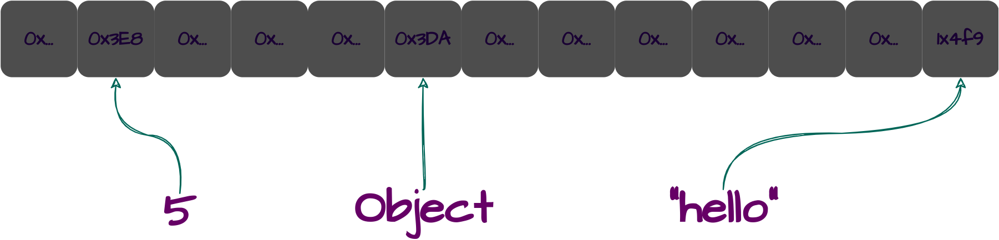

TODO: Obs: se for fazer algo matematico, que seja apenas uma relação matematica simples

# Vector

## Simple Definition

A vector is a data structure consisting of a collection of elements (values or variables) one-dimensional, all of its elements are of the same data type (therefore, same memory size), and each element is identified by at one array index.

## Formal Definition

Um vetor unidimensional $V$ pode ser definido como uma relação, onde o vetor $V$ é a aplicação dos indices $i$ de $S$ para os valores $x$ de um [abstract data type](https://en.wikipedia.org/wiki/Abstract_data_type) $T$ na forma:

### $$V: S\rightarrow T\Leftrightarrow(i\in S,\exists !x\in T\text{ | }(i,x)\in V)$$

de forma simplicada:

### $$V=\{(i,x)\text{ | }i\in S, x\in T\text{ and }x=V[i]\}$$

onde $T$ é um [ADT](https://en.wikipedia.org/wiki/Abstract_data_type) para representar os valores $x$ contidos no vetor $V$, que são identificados por um indice $i$ (ou seja, $x=V[i]$). Esse indice $i$ pertence a uma sequência $S$ dos naturais incluindo o 0, $\mathbb{N}_0$. Ou seja:

### $$V:\{0,1,2,\dots,n-1\}\rightarrow T$$

Esta notação deixa claro que cada índice $i$ tem um único valor associado $x$, e isso é expresso pela unicidade da existência de $x$ para cada $i$.

#### Exemplo: TODO: mudar esse exemplo e todos os outros para não estarem ordenados e terem pelo menos um elemento duplicado

Vamos dizer que nossos elementos $x$ serão um conjunto $E$ de alguns números inteiros (ou seja, $x\in E | E\subset\mathbb{Z}\subset T$), como exemplo $E=\{-37,-2,0,3,9,94\}$, de acordo com a definição temos:

### $$V:\{0,1,2,\dots,n-1\}\rightarrow \{-37,-2,0,3,9,94\}$$

Sendo então $(i\in \{0,1,2,\dots,n-1\},\exists !x\in \{-37,-2,0,3,9,94\}\text{ | }(i,x)\in V)$ temos que:

### $$V=\{(0,-37)\text{; }(1,-2)\text{; }(2,0)\text{; }(3,3)\text{; }(4,9)\text{; }(5,94)\}$$

Então se sabemos que $x=V[i]$ nessa relação, sabemos que:
 - $V[0]=-37$
 - $V[1]=-2$
 - $V[2]=0$
 - $V[3]=3$
 - $V[4]=9$
 - $V[5]=94$

Essa é a definição geral, qualquer tipo de vetor unidimensional se comporta da forma apresentada. A diferença é como cada vetor implementa isso na memória do computador.

Partindo agora dessa mesma definição, veremos como cada tipo de vetor implementa essa definição na memória.

# Tipos de Vector

### Existem dois tipos

 1. **Vetor estático, que chamamos de array**: nele não é possível aumentar o tamanho após a criação;
 2. **Vetor dinâmico, que chamamos de lista**: nele é possível aumentar o tamanho após a criação.

Antes de definir os dois tipos de vetores e como eles se comportam em memória, vamos precisar duas notações de para abstrair o conceito de locação de memória.

### Notações de Alocação de Memória: LOC e CONTENT

Para abstrair a alocação de memória no computador, utilizaremos a notação de Donald Knuth em _The Art of Computer Programming_. Essa notação nos permite representar conteúdos e endereços de memória de forma simplificada e clara.

Com as notações LOC e CONTENT, podemos encontrar valores a partir de endereços e vice-versa.

CONTENT é uma função que recebe um endereço de memória e retorna o conteúdo armazenado nesse endereço. Por outro lado, LOC é uma função que recebe um conteúdo e retorna o endereço de memória onde esse conteúdo está localizado.

Como exemplo, considere os seguintes valores com seus respectivos endereços na memória:

| Endereço na Memória | Valor/Conteúdo |
| - | - |
| 0x3E8 | 5 |
| 0x3DA | Object {"id": 2, "name": "Bob"} |
| 1x4F9 | "hello" |

Com as notações LOC e CONTENT, temos que:

### $$\text{CONTENT}(\text{0x3da})=\text{\{"id": 2, "name": "Bob"\}}$$

### $$\text{CONTENT}(\text{1x4f9})=\text{"hello"}$$

### $$\text{LOC}(\text{"hello"})=\text{1x4f9}$$

<h6>(podemos inferir facilmente que):</h6>

### $$\text{CONTENT}(\text{LOC}(\text{"hello"}))=\text{"hello"}$$

### Vetor Estatico: ARRAY.

Um vetor estatico (que vamos chamar apenas de array daqui em diante) é aquele que é estático na memória, ou seja, é de tamanho fixo, de forma que não podemos alterar seu tamanho após sua inicialização.

Além de tamanho fixo, o array é alocado de maneira sequencial na memória, ou seja, em pedaços contiguos sem buracos. Formalmente quando ele respeita a seguinte equação:

### $$\text{LOC}(V[i+1])=\text{LOC}(V[i])+c$$

Onde $c$ é o quanto de memória ocupa o tipo $T$ do conteúdo $x$ do array $V$.

Como ponto de partida, vamos usar o mesmo [exemplo](#exemplo) usado, porém aqui vamos definir que o tipo de $x$ é um inteiro de 32 bits, ou seja, $c=32$ que em hexadecimal é `0x0004`.

diagrama aqui

| indices $i$ | elements $x$ | tamnho do array $c$ | memory address |
| - | - | - | - |
| 0 | -37 | 0x0004 | 0x1000 |
| 1 | -2 | 0x0004 | 0x1004 |
| 2 | 0 | 0x0004 | 0x1008 |
| 4 | 3 | 0x0004 | 0x100C |
| 5 | 9 | 0x0004 | 0x1010 |
| 6 | 94 | 0x0004 | 0x1014 |

Assim, provamos a sequencialidade na memória da seguinte forma (usando $i=4$):

### $$\underbrace{\underbrace{\text{LOC}(V[4+1])}_{\text{LOC}(\text{9})}}_{\text{0x1010}} = \underbrace{\underbrace{\text{LOC}(V[4])}_{\text{LOC}(3)}}_{\text{0x100C}}+\text{0x0004}$$

Como `0x100C` $+$ `0x0004` $=$ `0x1010`, isso implica que o array está armazenado de forma sequencial! Caso não estivesse armazenado dessa mesma forma (sequencial), a equação não funcionaria.

diagrama aqui

| indices $i$ | elements $x$ | tamnho do array $c$ | memory address |
| - | - | - | - |
| 0 | -37 | 0x0004 | 0x1000 |
| 1 | -2 | 0x0004 | 0x1004 |
| 2 | 0 | 0x0004 | 0x1014 |
| 4 | 3 | 0x0004 | 0x101C |
| 5 | 9 | 0x0004 | 0x1028 |
| 6 | 94 | 0x0004 | 0x1034 |

### $$\underbrace{\underbrace{\text{LOC}(V[4+1])}_{\text{LOC}(\text{9})}}_{\text{0x1028}} \not = \underbrace{\underbrace{\text{LOC}(V[4])}_{\text{LOC}(3)}}_{\text{0x101C}}+\text{0x0004}$$

Como `0x101C` $+$ `0x0004` $\not =$ `0x1028$`, isso implica que o array **não está** armazenado de forma sequencial! 

### Vetor Dinamico: LISTA.

Um vetor dinamico (que vamos chamar apenas de lista daqui em diante) é aquele que é dinamico na memória. Isso implica que a lista cresce ou diminui dinamicamente à medida que os elementos são adicionados ou removidos.

O funcionamento de uma lista usa internamente um array, mas como podemos ser dinamicos usando do estatico? A resposta está na estretegia do funcionamento da lista, a chamada Resizable Array.

A lista inicial terá uma aparencia comum, da mesma forma de um vetor generico, porém na memória será um tanto diferente, porém internamente como a lista usa array, a forma como estará na memória será de forma sequencial, porém a lista terá uma capacidade acima da nescessaria, por exemplo, se a lista inicial tiver 10 elementos, internamente teremos um array com 10 elementos porém com a capacidade de suportar até 20 elementos, isso se lista usar como estrategia uma capacidade que será o dobro do seu tamanho, ou seja, usamos pré-alocação de espaço.

diagrama aqui

Mas, e se o número de elementos adicionados ultrapassar a capacidade pré-alocada? Nesse caso, a lista irá pré-alocars ainda mais espaço. O mesmo ocorre quando você remove elementos, reduzindo o tamanho conforme necessário.

Mas isso não funciona magicamente. Infelizmente, não podemos simplesmente adicionar ou remover bytes da lista, como a lista usa internamente um array, e, como não é possível adicionar ou remover bytes diretamente no array, naturalmente não é possível fazer o mesmo com ArrayList.

Então, como que a lista, mesmo com espaço pré-alocado, consegue adicionar mais espaço? A resposta está na "realocação" do array interno. Quando atinge a capacidade máxima, a lista cria um novo array interno com capacidade maior e, em seguida, copia os elementos do array antigo para o novo array.

diagrama

## colocar isso https://gulybyte.github.io/articles/estrutura-de-dados-java/list/array-list#vantagens-e-desvantagens

## BIG O

| Operation | ARRAY | LIST |
| - | - | - |
| **Access** | $\text{O}(1)$ | $\text{O}(1)$ |
| **Search** | $\text{O}(n)$ | $\text{O}(n)$ |
| **Insertion** | N/A | $\text{O}(n)$ |
| **Deletion** | N/A | $\text{O}(n)$ |
| **Appending** | N/A | $\text{O}(1)$ |

Em cada operação abaixo, colocar um mini algoritmo em Lua para demonstração.

#### Access
explicar aqui o porque ele tem O de 1, que é por ser indexavel, então através do indice é rápido por ser sequencial na memória, assim aritmetica de ponteiro... bla bla

#### Search
Para ambos é $\text{O}(n)$, pois potencialmente teremos que percorrer todos os elementos até encontrar

#### Insertion/Deletion
A inserção e deleção não é póssivel no array, mas na lista sim, e é $\text{O}(n)$ pois no pior caso, onde a nova inserção vai passar do size atual do array, vamos ter que copiar todos os elementos do array (estrategia resizable array) um por um $n$ para um novo espaço de memória para ai sim poder inserir nesse novo, ou no caso da deleção será o caso que teremos que redimensionar o array para ficar menor, novamente copiando o elementos um a um $n$.

(um diagrama aqui fica top)

#### Appending

# References:
 - Knuth vol 1
 - https://youtu.be/PEnFFiQe1pM
 - https://youtu.be/tvw4v7FEF1w

### Estruturas Associadas
 - **Resizable Array**: Uma estrutura que permite comportamento de um lista (vetor dinâmico), mas que internamente usa um array (vetor estático). Exemplo: [em Java, a classe ArrayList que gerencia o redimensionamento automaticamente](https://gulybyte.github.io/articles/estrutura-de-dados-java). parece que vale a pena para manter O(1)

A forma como são implementados varia entre as linguagens de programação, [veja mais aqui](examples/).
