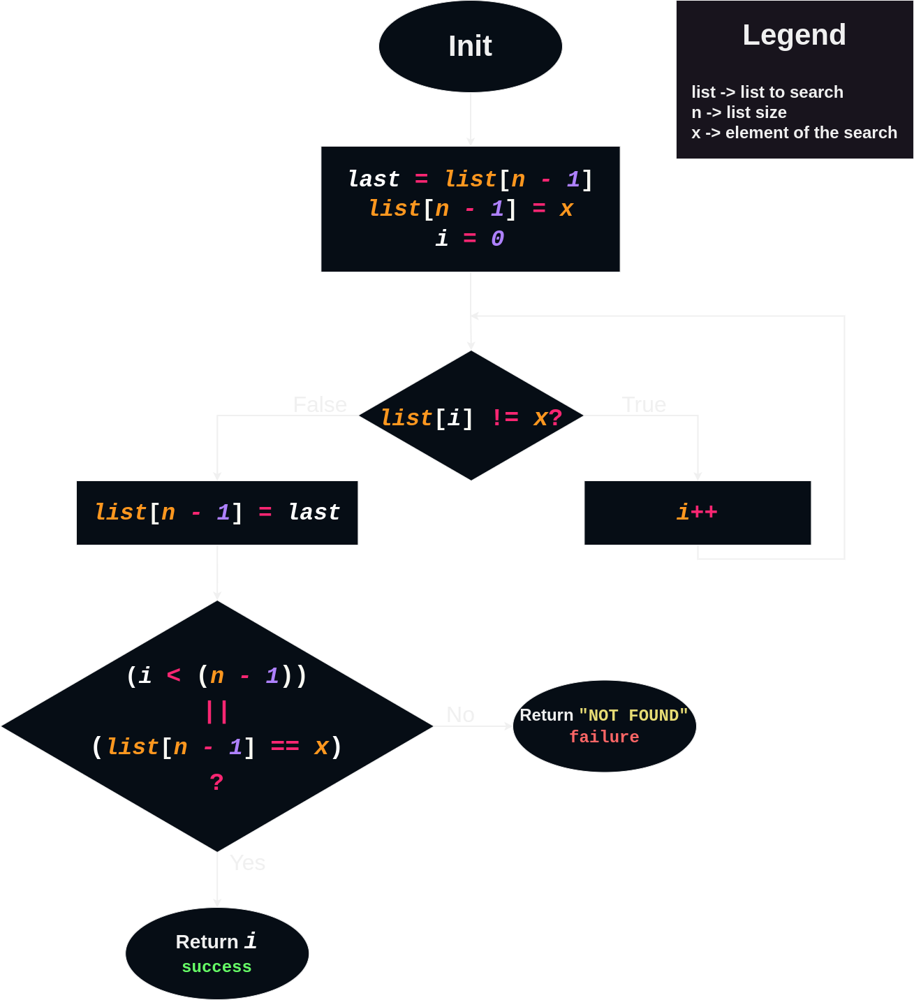
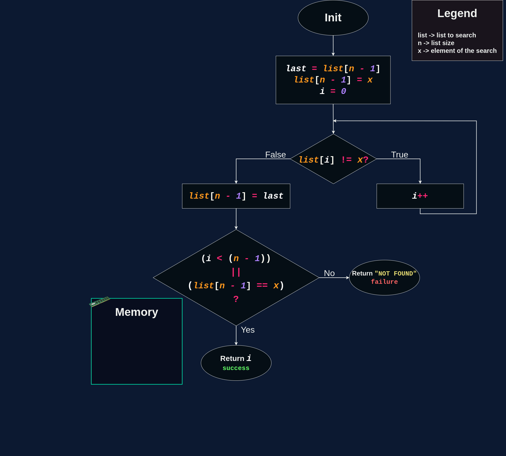

# Sentinel Linear Search

The Sentinel Linear Search algorithm is an optimized variation of the conventional linear search, which adds a special element (the sentinel) at the end of the list. This sentinel allows the search to be terminated as soon as the desired value is found, eliminating the need to check the end of the list at each iteration. This results in a significant reduction in the number of comparisons required.

# The Algorithm
> Flowchart (pseudocode):

  

> Animation:

  

<h6>Note: If the difference between Sentinel Linear Search and Linear Search is not clear, it is because both have a comparison (if-else) and a loop (for-while). However, if you look at the diagram I left in both (pseudocode), you will notice that the comparison in Linear Search is inside the loop, which means that there is a comparison in each iteration. In contrast, in Sentinel Linear Search, the comparison is outside the loop, so there is only one comparison.</h6>

# Big-O Complexity for Binary Search
## $$\text{Time Complexity:}$$ $$\Omega(1)$$ $$\Theta(n)$$ $$O(n)$$ $$\text {Space Complexity:}$$ $$O(1) $$
