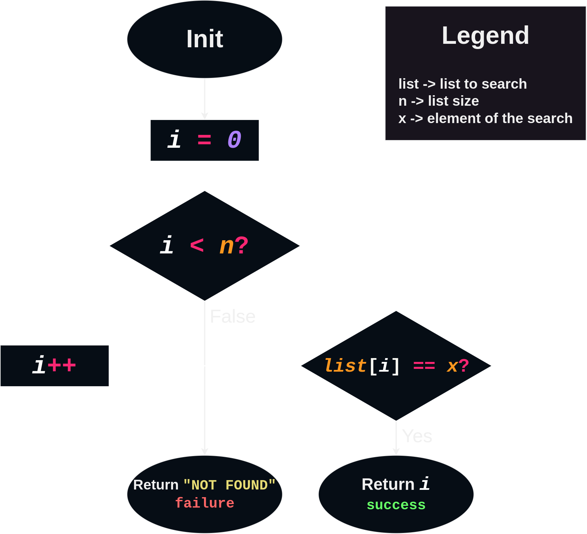

# Linear Search or Sequential Search
> _"Progressing from one stage to another in a single series of steps; sequential."_ ― **["a linear narrative"](https://translate.google.com.br/details?&text=linear)**.

Sequentially checks each element of the list until a match is found or the whole list has been searched. ― [Wikipedia](https://en.wikipedia.org/wiki/Linear_search) ***; It's exatly the proccess of a linear search.***

# The Algorithm
> Flowchart (pseudocode):

  

> Animation:

  

# Big-O Complexity for Binary Search
## $$\text{Time Complexity:}$$ $$\Omega(1)$$ $$\Theta(n)$$ $$O(n)$$ $$\text {Space Complexity:}$$ $$O(1) $$
