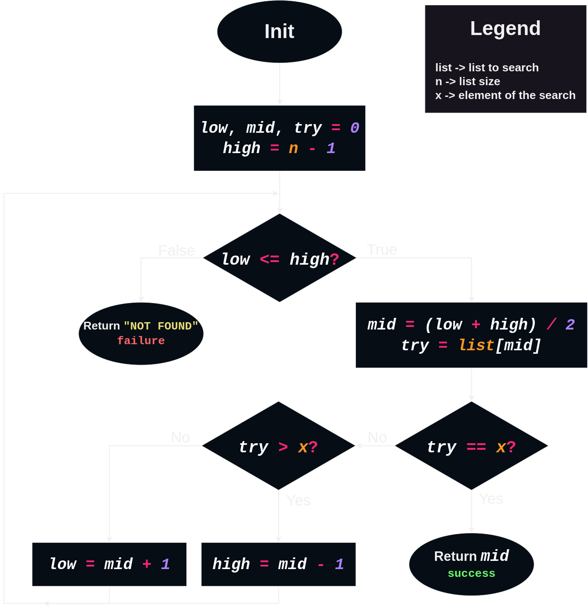

# Binary Search
> _"Divide and Conquer."_ ― **Julius Caesar**.

A divide-and-conquer algorithm recursively breaks down a problem into two or more sub-problems of the same or related type, until these become simple enough to be solved directly. ― [Wikipedia](https://en.wikipedia.org/wiki/Divide-and-conquer_algorithm) ***; It's exatly the proccess of a binary search.***

# The Algorithm
> Flowchart (pseudocode):

  

> Animation:

  

# Big-O Complexity for Binary Search
## $$\text{Time Complexity:}$$ $$\Omega(1)$$ $$\Theta(log\text{ }n)$$ $$O(log\text{ }n)$$ $$\text {Space Complexity:}$$ $$O(1) $$
